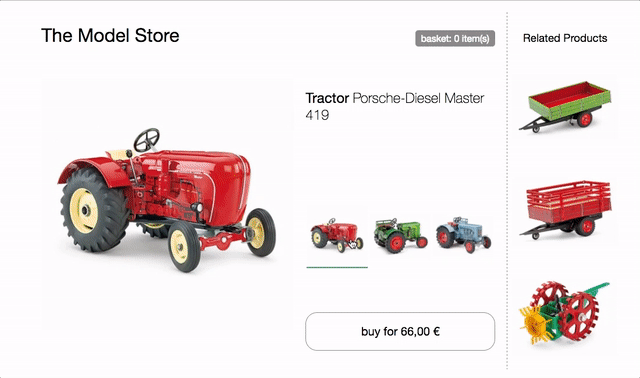

**This site is a work in progress and will be extended on a regular basis. Please watch the repository to recieve change notifications.**

# Micro Frontends

This repository ~~contains~~ <u>will contain</u> techniques, strategies and recipes for __building a modern web app with multiple independent teams__.

## What are Micro Frontends?

The term __Micro Frontends__ first came up in [ThoughtWorks Technology Radar](https://www.thoughtworks.com/radar/techniques/micro-frontends) at the end of 2016. It extends the concepts of micro services to the frontend world. The current trend is to build a feature-rich and powerful browser application, aka single page app, which sits ontop of a micro service architecture. Over time the frontend layer, often developed by a seperate team, grows and gets more difficult to maintain. That's what we call a [Frontend Monolith](https://www.youtube.com/watch?v=pU1gXA0rfwc).

The idea behind Micro Frontends is to think about your __UI as a composition of components__ which is maintained by __independent teams__. These teams are cross functional and develop features __end-to-end__, from database to user interface.

However, this idea is not new, in the past it went by the name of [Frontend Integration for Verticalized Systems](https://dev.otto.de/2014/07/29/scaling-with-microservices-and-vertical-decomposition/) or [Self contained Systems](https://www.innoq.com/de/podcast/025-scs-frontend-integration/). But Micro Frontends is clearly a more friendly and less bulky term.

## What's a modern web app?

In the introduction I've used the phrase "building a modern web app". Let's define the assumptions that are connected with this term.

To put this into a broader perspective, [Aral Balkan](https://ar.al/) has written a blog post about what he calls the [Documents‐to‐Applications Continuum](https://ar.al/notes/the-documents-to-applications-continuum/). He comes up with the conecpt of a sliding scale where a site, built out of __static documents__, connected via links is __on the left__ end and a pure behaviour driven, __contentless applications__ like an online photo editor is __on the right__.

If you would position your project on the __left side of this spectrum__, an __integration on webserver level__ is a good fit. With this model a server collects and __concatenates HTML strings__ from all components that makup the page requested by the user. Updates are done by reloading the page from the server or replacing parts of it via ajax. [Gustaf Nilsson Kotte](https://twitter.com/gustaf_nk/) has written a [comprehensive article](https://gustafnk.github.io/microservice-websites/) on this topic.

When your user interface has to provide __instant feedback__, even on unreliable connections, a pure server rendered site is not sufficient anymore. To implement techniques like [Optimistic UI](https://www.smashingmagazine.com/2016/11/true-lies-of-optimistic-user-interfaces/) or [Skeleton Screens](http://www.lukew.com/ff/entry.asp?1797) you need to be able to also __update__ your UI __on the device itself__. Google's term [Progressive Web Apps](https://developers.google.com/web/progressive-web-apps/) aptly describes the __balancing act__ of being a good citizen of the web (progressive enhancement) while also providing app-like performance. This kind of application is located somewhere __around the middle of the site-app-continuum__. Here a solely server based solution is not sufficient anymore. We have to move the __integration into the browser__ and this is the focus of this article.

## The DOM is the API

[Custom Elements](https://developers.google.com/web/fundamentals/getting-started/primers/customelements), the interoperability aspect from the Web Components Spec, are a good primitive for integration in the browser. Each team builds their component __using their web technology of choice__ and __wraps it inside a Custom Element__ (e.g. `<order-minicart></order-minicart>`). The DOM specification of this particular element (tag-name, attributes & events) acts as the contract for other teams. The advantage is that they can use the component and its functionality without having to know the implementation.

But Custom Elements alone are not the solution to all our needs. To address progressive enhancment, universal rendering or routing we need additional pieces of software.

This page is divided into two main areas. First we will discuss [Page Composition](#page-composition) - how to assamble a page out of components owned by different teams. After that we'll show examples for implementing clientside [Page Transition](#page-transition).

## Page Composition

Beside the __client-__ and __serverside__ integration of code written in __different frameworks__ itself, there are a lot of side topics that should be discussed. Mechanisms to __isolate js__, __avoid css conflicts__, __load ressources__ as needed, __share common ressources__ between teams, handle __data fetching__ and think about good __loading states__ for the user. We'll go into these topics one step at a time.

### The Base Prototype

This product page of the imaginative model store will serve as the basis for the following examples.

It features a __variant selector__ to switch between the three different tractor models. On change product image, name, price and recommendations are updated. There is also a __buy button__, which adds the selected variant to the basket and a __minibasket__ at the top that updated accordingly.

[try in browser](./0-model-store/)

All HTML is generated client side using __plain JavaScript__ and ES6 Template Strings with __no dependencies__. The code uses a simple state/markup separation and rerenders the entiere html client side on every change - no fancy DOM diffing and __no universal rendering__ for now. Also __no team separation__ - [the code](https://github.com/neuland/micro-frontends/tree/master/0-model-store) is written in one js/css file.

### Clientside Integration

tba

...

## Page Transition

tba

## Additional Resources
[Slides: Micro Frontends by Michael Geers | JSUnconf.eu 2017](https://speakerdeck.com/naltatis/micro-frontends-building-a-modern-webapp-with-multiple-teams)

---

## TODOs

Working code examples will be added here ...

- Use Cases
  - Composing a page
    - client only
    - universal render
  - Communication
    - parent-child
    - child-parent
    - siblings
  - Navigating between pages
    - soft vs. hard navigation
    - universal router
  - ...
- Side Topics
  - Coherent User Interface / Style Guides & Pattern Libraries
  - Progressive Enhancement
  - Performance on initial load
  - Performance while using the site
  - Loading CSS
  - Loading JS
  - ...
