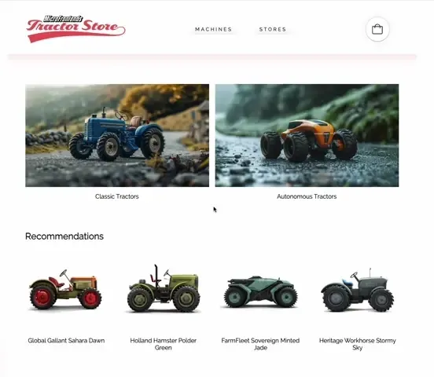

تکنیک‌ها، استراتژی‌ها و راهکارهایی برای ساخت یک **وب اپلیکیشن مدرن** با **چندین تیم** که بتوانند **ویژگی‌ها را به صورت مستقل** ارائه دهند.

## میکرو فرانت‌اند‌ها چیستند؟

اصطلاح **میکرو فرانت‌اند‌ها** برای اولین بار در [ThoughtWorks Technology Radar](https://www.thoughtworks.com/radar/techniques/micro-frontends) در اواخر سال ۲۰۱۶ مطرح شد. این مفهوم، مفاهیم میکروسرویس‌ها را به دنیای فرانت‌اند گسترش می‌دهد. روند فعلی ساخت برنامه‌های مرورگر قدرتمند و غنی از ویژگی‌ها، که به آن‌ها اپلیکیشن تک صفحه‌ای (SPA) نیز می‌گویند، است و بر روی معماری میکروسرویس‌ها قرار می‌گیرد. با گذشت زمان، لایه فرانت‌اند که اغلب توسط یک تیم مجزا توسعه داده می‌شود، رشد کرده و نگهداری آن دشوار می‌شود. این همان چیزی است که ما آن را [فرانت‌اند یکپارچه](https://www.youtube.com/watch?v=pU1gXA0rfwc) می‌نامیم.

ایده پشت میکرو فرانت‌اند‌ها این است که به یک وب‌سایت یا وب اپلیکیشن به عنوان **ترکیبی از ویژگی‌ها** نگاه کنیم که توسط **تیم‌های مستقل** مالکیت می‌شوند. هر تیم یک **حوزه تجاری** یا **ماموریت** مشخص دارد که به آن اهمیت می‌دهد و در آن تخصص دارد. یک تیم **چند کاره** است و ویژگی‌های خود را به صورت **انتهای به انتها** توسعه می‌دهد، از پایگاه داده تا رابط کاربری.

با این حال، این ایده جدید نیست. این مفهوم شباهت زیادی با مفهوم [سیستم‌های خودکفا](http://scs-architecture.org/) دارد. در گذشته رویکردهایی مانند این با نام [ادغام فرانت‌اند برای سیستم‌های عمودی](https://www.otto.de/jobs/en/technology/techblog/blogpost/architecture-principles-2013-04-15.php) شناخته می‌شدند. اما میکرو فرانت‌اند‌ها به وضوح اصطلاحی دوستانه‌تر و کمتر حجیم است.

**فرانت‌اند‌های یکپارچه**

**سازماندهی به صورت عمودی**

## یک وب اپلیکیشن مدرن چیست؟

در مقدمه از عبارت "ساخت یک وب اپلیکیشن مدرن" استفاده کردم. بیایید فرضیاتی که با این عبارت مرتبط است را تعریف کنیم.

برای دیدگاه گسترده‌تر، [Aral Balkan](https://ar.al/) یک پست وبلاگی در مورد چیزی که آن را [پیوستار از اسناد به اپلیکیشن‌ها](https://ar.al/notes/the-documents-to-applications-continuum/) می‌نامد، نوشته است. او با مفهوم یک مقیاس کشویی ارائه می‌دهد که در آن یک سایت، ساخته شده از **اسناد ایستا** که از طریق پیوندها متصل شده‌اند، در **سمت چپ** قرار دارد و یک اپلیکیشن کاملاً مبتنی بر رفتار، **بدون محتوا** مانند یک ویرایشگر عکس آنلاین در **سمت راست** قرار دارد.

اگر پروژه شما در **سمت چپ این طیف** قرار دارد، **ادغام در سطح وب سرور** مناسب است. در این مدل، یک سرور رشته‌های HTML را از همه اجزایی که صفحه درخواست شده توسط کاربر را تشکیل می‌دهند، جمع‌آوری و به هم متصل می‌کند. به‌روزرسانی‌ها با بارگذاری مجدد صفحه از سرور یا جایگزینی بخش‌هایی از آن از طریق ای‌جکس انجام می‌شود. [Gustaf Nilsson Kotte](https://twitter.com/gustaf_nk/) مقاله‌ای [جامع](https://gustafnk.github.io/microservice-websites/) در این زمینه نوشته است.

وقتی رابط کاربری شما باید **بازخورد فوری** ارائه دهد، حتی در اتصالات نامطمئن، یک سایت کاملاً رندر شده توسط سرور دیگر کافی نیست. برای پیاده‌سازی تکنیک‌هایی مانند [رابط کاربری خوشبینانه](https://www.smashingmagazine.com/2016/11/true-lies-of-optimistic-user-interfaces/) یا [صفحات اسکلتی](http://www.lukew.com/ff/entry.asp?1797) نیاز دارید که بتوانید رابط کاربری خود را **روی خود دستگاه** نیز به‌روزرسانی کنید. اصطلاح [وب اپلیکیشن‌های پیشرفته](https://developers.google.com/web/progressive-web-apps/) که توسط گوگل استفاده می‌شود، به‌خوبی **تعادل** بین بهبود پیش‌رونده و ارائه عملکردی شبیه به اپلیکیشن را توصیف می‌کند. این نوع اپلیکیشن در جایی **در میانه طیف سایت-اپلیکیشن** قرار دارد. در اینجا یک راه‌حل صرفاً مبتنی بر سرور دیگر کافی نیست. ما باید **ادغام را به داخل مرورگر** منتقل کنیم، و این تمرکز این مقاله است.

## ایده‌های اصلی پشت میکرو فرانت‌اندها

* **بی‌طرف بودن نسبت به فناوری**  هر تیم باید بتواند فناوری خود را انتخاب و به‌روزرسانی کند بدون نیاز به هماهنگی با تیم‌های دیگر. [Custom Elements](#the-dom-is-the-api) راهی عالی برای پنهان کردن جزئیات پیاده‌سازی در حالی که یک رابط خنثی به دیگران ارائه می‌دهد، است.
* **کد تیم را ایزوله کنید**  حتی اگر همه تیم‌ها از یک فریم‌ورک استفاده کنند، زمان اجرا را به اشتراک نگذارید. برنامه‌های مستقل بسازید که خودمختار باشند. به اشتراک‌گذاری وضعیت یا استفاده از متغیرهای سراسری اجتناب کنید.
* **تعیین پیشوند برای تیم‌ها**  در مواردی که هنوز امکان ایزوله‌سازی وجود ندارد، بر سر کنوانسیون‌های نام‌گذاری توافق کنید. برای جلوگیری از برخوردها و مشخص‌سازی مالکیت، CSS، رویدادها، ذخیره‌سازی محلی و کوکی‌ها را نام‌گذاری کنید.
* **ترجیح به ویژگی‌های بومی مرورگر به جای API‌های سفارشی**  به جای ایجاد یک سیستم PubSub سراسری، از [رویدادهای مرورگر برای ارتباط](#parent-child-communication--dom-modification) استفاده کنید. اگر مجبور به ساخت API‌های بین تیمی هستید، آن را تا حد امکان ساده نگه دارید.
* **ساخت یک سایت مقاوم**  ویژگی شما باید حتی در صورت شکست خوردن جاوااسکریپت یا عدم اجرای آن نیز مفید باشد. از [رندرینگ جهانی](#server-side-rendering--universal-rendering) و پیشرفت تدریجی استفاده کنید تا عملکرد بهتری درک شود.

---

## DOM به عنوان API

[Custom Elements](https://developers.google.com/web/fundamentals/getting-started/primers/customelements)، که جنبه هم‌کاری از مشخصات Web Components را دارد، یک ساختار پایه‌ای خوب برای ادغام در مرورگر است. هر تیم کامپوننت خود را **با استفاده از فناوری وب دلخواه خود** ساخته و **آن را داخل یک عنصر سفارشی** قرار می‌دهد (مثال: `<order-minicart></order-minicart>`). مشخصات DOM این عنصر خاص (نام تگ، ویژگی‌ها و رویدادها) به عنوان قرارداد یا API عمومی برای تیم‌های دیگر عمل می‌کند. مزیت این روش این است که تیم‌های دیگر می‌توانند از کامپوننت و قابلیت‌های آن بدون نیاز به دانستن جزئیات پیاده‌سازی استفاده کنند. آن‌ها فقط باید توانایی تعامل با DOM را داشته باشند.

اما Custom Elements به تنهایی تمام نیازهای ما را برطرف نمی‌کند. برای پاسخگویی به پیشرفت تدریجی، رندرینگ جهانی یا مسیریابی، به قطعات نرم‌افزاری اضافی نیاز داریم.

این صفحه به دو بخش اصلی تقسیم شده است. ابتدا در مورد [ترکیب صفحه](#page-composition) - چگونگی ساخت یک صفحه از کامپوننت‌های متعلق به تیم‌های مختلف - بحث خواهیم کرد. سپس مثال‌هایی برای پیاده‌سازی [انتقال صفحه سمت کاربر](#navigating-between-pages) ارائه خواهیم کرد.

## ترکیب صفحه

علاوه بر ادغام __سمت کاربر__ و __سمت سرور__ کد نوشته شده در __فریم‌ورک‌های مختلف__، موضوعات جانبی زیادی وجود دارد که باید بحث شوند: مکانیزم‌هایی برای __ایزوله کردن جاوااسکریپت__، __جلوگیری از تداخل‌های CSS__، __بارگذاری منابع__ در زمان نیاز، __اشتراک منابع مشترک__ بین تیم‌ها، مدیریت __فراخوانی داده‌ها__ و تفکر در مورد __وضعیت بارگذاری__ مناسب برای کاربر. به این موضوعات به صورت مرحله به مرحله خواهیم پرداخت.

### نمونه اولیه پایه

صفحه محصول این فروشگاه مدل تراکتور به عنوان پایه برای مثال‌های زیر استفاده خواهد شد.

این صفحه دارای یک __انتخابگر واریانت__ است که بین سه مدل مختلف تراکتور جابجا می‌شود. با تغییر، تصویر محصول، نام، قیمت و پیشنهادات به‌روزرسانی می‌شوند. همچنین یک __دکمه خرید__ وجود دارد که واریانت انتخاب شده را به سبد خرید اضافه می‌کند و یک __مینی سبد__ در بالا که متناسب با آن به‌روزرسانی می‌شود.

[امتحان در مرورگر](./0-model-store/) و [بازبینی کد](https://github.com/neuland/micro-frontends/tree/master/0-model-store)

تمام HTML به صورت سمت کاربر با استفاده از __جاوااسکریپت ساده__ و رشته‌های قالب ES6 تولید شده است و __هیچ وابستگی__ ندارد. کد از یک جداسازی ساده وضعیت/مارکاپ استفاده می‌کند و کل HTML را در هر تغییر به صورت سمت کاربر رندر مجدد می‌کند - بدون دیفینگ پیشرفته DOM و __بدون رندرینگ جهانی__ در حال حاضر. همچنین __بدون جداسازی تیم‌ها__ - [کد](https://github.com/neuland/micro-frontends/tree/master/0-model-store) در یک فایل js/css نوشته شده است.

### ادغام سمت کاربر

در این مثال، صفحه به کامپوننت‌ها/قطعات جداگانه‌ای تقسیم شده که به سه تیم تعلق دارند. __تیم Checkout__ (آبی) اکنون مسئول هر چیزی است که به فرآیند خرید مربوط می‌شود - یعنی __دکمه خرید__ و __مینی سبد__. __تیم Inspire__ (سبز) مدیریت __پیشنهادات محصول__ را در این صفحه بر عهده دارد. خود صفحه متعلق به __تیم Product__ (قرمز) است.

[امتحان در مرورگر](./1-composition-client-only/) و [بازبینی کد](https://github.com/neuland/micro-frontends/tree/master/1-composition-client-only)

__تیم Product__ تصمیم می‌گیرد که کدام قابلیت‌ها شامل شوند و در کجای چیدمان قرار گیرند. صفحه حاوی اطلاعاتی است که می‌تواند توسط خود تیم Product ارائه شود، مانند نام محصول، تصویر و واریانت‌های موجود. اما همچنین شامل قطعاتی (Custom Elements) از تیم‌های دیگر است.

### چگونه یک عنصر سفارشی ایجاد کنیم؟

بیایید __دکمه خرید__ را به عنوان مثال در نظر بگیریم. تیم Product دکمه را با اضافه کردن `<blue-buy sku="t_porsche"></blue-buy>` به مکان مورد نظر در مارکاپ قرار می‌دهد. برای اینکه این کار عمل کند، تیم Checkout باید عنصر `blue-buy` را در صفحه ثبت کند.

    class BlueBuy extends HTMLElement {
      connectedCallback() {
        this.attachShadow({ mode: 'open' });
        this.shadowRoot = `<button type="button">buy for 66,00 €</button>`;
      }

      disconnectedCallback() { ... }
    }
    window.customElements.define('blue-buy', BlueBuy);

اکنون هر بار که مرورگر به تگ `blue-buy` جدیدی برخورد می‌کند، `connectedCallback` فراخوانی می‌شود. `this` به ریشه DOM عنصر سفارشی اشاره می‌کند. همه ویژگی‌ها و متدهای یک عنصر استاندارد DOM مانند `innerHTML` یا `getAttribute()` می‌توانند استفاده شوند.

هنگام نام‌گذاری عنصر، تنها نیازمندی که مشخصات تعیین کرده است این است که نام باید __شامل یک خط تیره (-)__ باشد تا با تگ‌های جدید HTML سازگار باقی بماند. در مثال‌های آینده، کنوانسیون نام‌گذاری `[team_color]-[feature]` استفاده می‌شود. فضای نام تیم از برخوردها جلوگیری می‌کند و به این ترتیب مالکیت ویژگی تنها با نگاه به DOM آشکار می‌شود.

### ارتباط والد-فرزند / تغییر DOM

هنگامی که کاربر تراکتور دیگری را در __انتخابگر واریانت__ انتخاب می‌کند، __دکمه خرید باید به‌روزرسانی__ شود. برای این کار تیم Product می‌تواند به سادگی عنصر موجود را از DOM __حذف__ کرده و عنصر جدیدی __وارد__ کند.

    container.innerHTML;
    // => <blue-buy sku="t_porsche">...</blue-buy>
    container.innerHTML = '<blue-buy sku="t_fendt"></blue-buy>';

`disconnectedCallback` عنصر قدیمی هم‌زمان فراخوانی می‌شود تا به عنصر فرصت پاک کردن کارهایی مانند گوش دادن به رویدادها داده شود. پس از آن `connectedCallback` عنصر `t_fendt` تازه ایجاد شده فراخوانی می‌شود.

یک گزینه دیگر و کارآمدتر این است که فقط ویژگی `sku` را در عنصر موجود به‌روزرسانی کنید.

    document.querySelector('blue-buy').setAttribute('sku', 't_fendt');

اگر تیم Product از یک موتور قالب‌بندی با قابلیت دیفینگ DOM، مانند React، استفاده کرده بود، این کار به صورت خودکار توسط الگوریتم انجام می‌شد.

برای پشتیبانی از این، عنصر سفارشی می‌تواند `attributeChangedCallback` را پیاده‌سازی کند و لیستی از `observedAttributes` را مشخص کند که باید این فراخوانی را ایجاد کنند.

    const prices = {
      t_porsche: '66,00 €',
      t_fendt: '54,00 €',
      t_eicher: '58,00 €',
    };

    class BlueBuy extends HTMLElement {
      static get observedAttributes() {
        return ['sku'];
      }
      connectedCallback() {
        this.render();
      }
      render() {
        if (!this.shadowRoot) {
          this.attachShadow({ mode: 'open' });
        }
        const sku = this.getAttribute('sku');
        const price = prices[sku];
        this.shadowRoot.innerHTML = `<button type="button">buy for ${price}</button>`;
      }
      attributeChangedCallback(attr, oldValue, newValue) {
        this.render();
      }
      disconnectedCallback() {...}
    }
    window.customElements.define('blue-buy', BlueBuy);

برای جلوگیری از تکرار، یک متد `render()` معرفی شده است که از `connectedCallback` و `attributeChangedCallback` فراخوانی می‌شود. این متد داده‌های مورد نیاز را جمع‌آوری کرده و مارکاپ جدید را با `innerHTML` می‌سازد. اگر تصمیم به استفاده از یک موتور قالب‌بندی پیچیده‌تر یا فریم‌ورک داخل عنصر سفارشی گرفته شد، اینجا جایی است که کد اولیه‌سازی آن قرار می‌گیرد.

### پشتیبانی مرورگر

مثال بالا از مشخصات عنصر سفارشی استفاده می‌کند که [توسط تمام مرورگرهای مدرن پشتیبانی می‌شود](http://caniuse.com/#feat=custom-elementsv1). هیچ پلی‌فیلی یا هکی مورد نیاز نیست.
همین موضوع برای [Shadow DOM](https://caniuse.com/shadowdomv1) نیز صدق می‌کند که برای کپسوله‌سازی مارکاپ و استایل‌های عنصر سفارشی استفاده می‌شود.

### سازگاری با فریم‌ورک‌ها

از آنجایی که عناصر سفارشی یک استاندارد وب هستند، تمام فریم‌ورک‌های اصلی جاوااسکریپت مانند React، Vue، Angular، Svelte یا Preact از آن‌ها پشتیبانی می‌کنند.
آن‌ها به شما اجازه می‌دهند یک عنصر سفارشی را در اپلیکیشن خود تعبیه کنید، همان‌طور که یک تگ HTML بومی است، و همچنین روش‌هایی را برای انتشار اپلیکیشن خاص فریم‌ورک خود به عنوان یک عنصر سفارشی فراهم می‌کنند.

### جلوگیری از هرج و مرج فریم‌ورک‌ها

استفاده از عناصر سفارشی یک راه عالی برای دستیابی به میزان بالایی از جداسازی بین قطعات تیم‌های مختلف است. به این ترتیب، هر تیم آزاد است فریم‌ورک فرانت‌اند مورد نظر خود را انتخاب کند. اما فقط به این دلیل که می‌توانید، به این معنی نیست که ایده عاقلانه‌ای است که فناوری‌های مختلف را مخلوط کنید. سعی کنید از [هرج و مرج میکرو فرانت‌اندها](https://www.thoughtworks.com/radar/techniques/micro-frontend-anarchy) جلوگیری کرده و یک سطح منطقی از هماهنگی بین تیم‌های مختلف ایجاد کنید. به این ترتیب، تیم‌ها می‌توانند دانش و بهترین روش‌ها را با یکدیگر به اشتراک بگذارند. همچنین زمانی که می‌خواهید یک کتابخانه الگو مرکزی ایجاد کنید، زندگی شما آسان‌تر خواهد شد.
با این حال، قابلیت ترکیب فناوری‌ها می‌تواند مفید باشد زمانی که با یک اپلیکیشن قدیمی کار می‌کنید و می‌خواهید به یک تکنولوژی جدید مهاجرت کنید.

### ارتباط فرزند-والد یا خواهر-برادر / رویدادهای DOM

اما انتقال ویژگی‌ها برای همه تعاملات کافی نیست. در مثال ما، __مینی سبد باید به‌روزرسانی شود__ زمانی که کاربر __روی دکمه خرید کلیک می‌کند__.

هر دو قطعه توسط تیم Checkout (آبی) مدیریت می‌شوند، بنابراین می‌توانند نوعی API جاوااسکریپت داخلی ایجاد کنند که به مینی سبد اطلاع دهد که دکمه فشرده شده است. اما این کار مستلزم این است که نمونه‌های کامپوننت یکدیگر را بشناسند و همچنین نقض جداسازی است.

یک روش پاک‌تر استفاده از مکانیزم PubSub است، جایی که یک کامپوننت می‌تواند پیامی را منتشر کند و کامپوننت‌های دیگر می‌توانند در موضوعات خاص مشترک شوند. خوشبختانه، مرورگرها این ویژگی را به صورت داخلی دارند. این دقیقاً همان چیزی است که رویدادهای مرورگر مانند `click`، `select` یا `mouseover` انجام می‌دهند. علاوه بر رویدادهای بومی، امکان ایجاد رویدادهای سطح بالاتر با `new CustomEvent(...)` نیز وجود دارد. رویدادها همیشه به گره DOM که در آن ایجاد/اعلام شده‌اند، متصل هستند. بیشتر رویدادهای بومی نیز دارای ویژگی حباب‌سازی هستند. این ویژگی امکان شنیدن همه رویدادها در یک زیربخش خاص از DOM را فراهم می‌کند. اگر بخواهید به همه رویدادهای صفحه گوش دهید، می‌توانید شنونده رویداد را به عنصر window متصل کنید. در اینجا نحوه ایجاد رویداد `blue:basket:changed` در مثال آورده شده است:

    class BlueBuy extends HTMLElement {
      [...]
      connectedCallback() {
        [...]
        this.render();
        this.shadowRoot.querySelector('button').addEventListener('click', this.addToCart);
      }
      addToCart() {
        // maybe talk to an api
        this.dispatchEvent(new CustomEvent('blue:basket:changed', {
          bubbles: true,
        }));
      }
      render() {
        if (!this.shadowRoot) {
          this.attachShadow({ mode: 'open' });
        }
        this.shadowRoot.innerHTML = `<button type="button">buy</button>`;
      }
      disconnectedCallback() {
        this.shadowRoot.querySelector('button').removeEventListener('click', this.addToCart);
      }
    }

مینی سبد اکنون می‌تواند در این رویداد در `window` مشترک شود و هنگام نیاز به تازه‌سازی داده‌های خود، اعلان دریافت کند.

    class BlueBasket extends HTMLElement {
      connectedCallback() {
        [...]
        window.addEventListener('blue:basket:changed', this.refresh);
      }
      refresh() {
        // fetch new data and render it
      }
      disconnectedCallback() {
        window.removeEventListener('blue:basket:changed', this.refresh);
      }
    }

با این رویکرد، قطعه مینی سبد یک شنونده به یک عنصر DOM که خارج از حوزه آن است (`window`) اضافه می‌کند. این کار برای بسیاری از برنامه‌ها مناسب است، اما اگر با این موضوع راحت نیستید، می‌توانید رویکردی را پیاده‌سازی کنید که در آن خود صفحه (تیم Product) به رویداد گوش داده و با فراخوانی `refresh()` بر روی عنصر DOM، به مینی سبد اطلاع دهد.

    // page.js
    const $ = document.getElementsByTagName;

    $('blue-buy')[0].addEventListener('blue:basket:changed', function() {
      $('blue-basket')[0].refresh();
    });

فراخوانی دستوری متدهای DOM نسبتاً نادر است، اما می‌توان آن را در [API عنصر ویدئو](https://developer.mozilla.org/en-US/docs/Web/API/HTMLMediaElement#methods) پیدا کرد. اگر ممکن است، استفاده از رویکرد اعلامی (تغییر ویژگی‌ها) باید ترجیح داده شود.

## رندرینگ سمت سرور / رندرینگ جهانی

عناصر سفارشی برای ادغام کامپوننت‌ها داخل مرورگر عالی هستند. اما هنگام ساخت یک سایت که بر روی وب قابل دسترسی است، احتمالاً عملکرد بارگذاری اولیه اهمیت دارد و کاربران ممکن است یک صفحه سفید ببینند تا زمانی که همه فریم‌ورک‌های جاوااسکریپت دانلود و اجرا شوند. علاوه بر این، بهتر است به این فکر کنید که چه اتفاقی برای سایت می‌افتد اگر جاوااسکریپت شکست بخورد یا مسدود شود. [Jeremy Keith](https://adactio.com/) اهمیت این موضوع را در کتاب الکترونیکی/پادکست خود [طراحی وب مقاوم](https://resilientwebdesign.com/) توضیح می‌دهد. بنابراین، توانایی رندر محتوای اصلی در سمت سرور بسیار مهم است. متأسفانه، مشخصات کامپوننت‌های وب در مورد رندر سمت سرور صحبتی نمی‌کند. بدون جاوااسکریپت، هیچ عنصر سفارشی :(

### عناصر سفارشی + درج‌های سمت سرور = ❤️

برای اینکه رندرینگ سمت سرور کار کند، مثال قبلی بازنویسی شده است. هر تیم سرور express خود را دارد و متد `render()` عنصر سفارشی نیز از طریق url قابل دسترسی است.

    $ curl http://127.0.0.1:3000/blue-buy?sku=t_porsche
    <button type="button">buy for 66,00 €</button>

نام تگ عنصر سفارشی به عنوان نام مسیر استفاده می‌شود - ویژگی‌ها به پارامترهای query تبدیل می‌شوند. اکنون روشی برای رندر سمت سرور محتوای هر کامپوننت وجود دارد. در ترکیب با عناصر سفارشی `<blue-buy>` چیزی که بسیار نزدیک به یک __کامپوننت وب جهانی__ است، به دست آمده است:

    <blue-buy sku="t_porsche">
      <!--#include virtual="/blue-buy?sku=t_porsche" -->
    </blue-buy>

نظر `#include` بخشی از [درج‌های سمت سرور](https://en.wikipedia.org/wiki/Server_Side_Includes) است که یک ویژگی در بیشتر وب سرورها است. بله، این همان تکنیکی است که در گذشته برای درج تاریخ فعلی در وب‌سایت‌هایمان استفاده می‌شد. همچنین چند تکنیک جایگزین مانند [ESI](https://en.wikipedia.org/wiki/Edge_Side_Includes)، [nodesi](https://github.com/Schibsted-Tech-Polska/nodesi)، [compoxure](https://github.com/tes/compoxure) و [tailor](https://github.com/zalando/tailor) وجود دارد، اما برای پروژه‌های ما، SSI به عنوان یک راه‌حل ساده و فوق‌العاده پایدار ثابت شده است.

نظر `#include` قبل از اینکه وب سرور صفحه کامل را به مرورگر ارسال کند، با پاسخ `/blue-buy?sku=t_porsche` جایگزین می‌شود. پیکربندی در nginx به این صورت است:

    upstream team_blue {
      server team_blue:3001;
    }
    upstream team_green {
      server team_green:3002;
    }
    upstream team_red {
      server team_red:3003;
    }

    server {
      listen 3000;
      ssi on;

      location /blue {
        proxy_pass  http://team_blue;
      }
      location /green {
        proxy_pass  http://team_green;
      }
      location /red {
        proxy_pass  http://team_red;
      }
      location / {
        proxy_pass  http://team_red;
      }
    }

دستور `ssi: on;` قابلیت SSI را فعال می‌کند و یک بلوک `upstream` و `location` برای هر تیم اضافه می‌شود تا اطمینان حاصل شود که تمام URL‌هایی که با `/blue` شروع می‌شوند به اپلیکیشن درست هدایت می‌شوند (`team_blue:3001`). علاوه بر این، مسیر `/` به تیم قرمز که کنترل صفحه اصلی/صفحه محصول را بر عهده دارد، نگاشت شده است.

این انیمیشن فروشگاه تراکتور را در یک مرورگر که __جاوااسکریپت غیرفعال__ است، نشان می‌دهد.

[بازبینی کد](https://github.com/neuland/micro-frontends/tree/master/2-composition-universal)

دکمه‌های انتخاب واریانت اکنون لینک‌های واقعی هستند و هر کلیک منجر به بارگذاری مجدد صفحه می‌شود. ترمینال در سمت راست فرآیند چگونگی مسیریابی درخواست صفحه به تیم قرمز را که کنترل صفحه محصول را بر عهده دارد، نشان می‌دهد و پس از آن مارکاپ با قطعات تیم آبی و سبز تکمیل می‌شود.

با روشن کردن دوباره جاوااسکریپت، فقط پیام‌های لاگ سرور برای درخواست اول قابل مشاهده خواهند بود. تمام تغییرات بعدی تراکتور به صورت سمت کاربر انجام می‌شود، دقیقاً مانند مثال اول. در یک مثال بعدی داده‌های محصول از جاوااسکریپت استخراج شده و در صورت نیاز از طریق یک API REST بارگذاری می‌شوند.

شما می‌توانید با این کد نمونه بر روی ماشین محلی خود بازی کنید. تنها چیزی که باید نصب شود [Docker Compose](https://docs.docker.com/compose/install/) است.

    git clone https://github.com/neuland/micro-frontends.git
    cd micro-frontends/2-composition-universal
    docker-compose up --build

Docker سپس nginx را روی پورت 3000 شروع کرده و تصویر node.js را برای هر تیم ایجاد می‌کند. هنگامی که [http://127.0.0.1:3000/](http://127.0.0.1:3000/) را در مرورگر خود باز می‌کنید، باید یک تراکتور قرمز را مشاهده کنید. لاگ ترکیبی `docker-compose` به راحتی نشان می‌دهد که در شبکه چه می‌گذرد. متأسفانه، هیچ راهی برای کنترل رنگ خروجی وجود ندارد، بنابراین باید با این واقعیت کنار بیایید که ممکن است تیم آبی با رنگ سبز برجسته شود :)

فایل‌های `src` در کانتینرهای مجزا نگاشت شده‌اند و برنامه node در صورت ایجاد تغییر در کد، مجدداً راه‌اندازی می‌شود. تغییر `nginx.conf` نیاز به راه‌اندازی مجدد `docker-compose` دارد تا تأثیر داشته باشد. بنابراین، با خیال راحت تغییرات خود را اعمال کنید و بازخورد دهید.

### فراخوانی داده‌ها و وضعیت‌های بارگذاری

یکی از نقاط ضعف رویکرد SSI/ESI این است که __کندترین قطعه زمان پاسخ کل صفحه را تعیین می‌کند__.
بنابراین بهتر است اگر پاسخ یک قطعه قابل کش باشد.
برای قطعاتی که تولید آن‌ها هزینه‌بر است و به سختی می‌توان آن‌ها را کش کرد، اغلب ایده خوبی است که آن‌ها را از رندر اولیه حذف کنید.
آن‌ها می‌توانند به صورت غیرهمزمان در مرورگر بارگذاری شوند.
در مثال ما، قطعه `green-recos` که پیشنهادات شخصی‌سازی شده را نشان می‌دهد، کاندیدای این کار است.

یک راه‌حل ممکن این است که تیم قرمز صرفاً از درج SSI صرف نظر کند.

**قبل از تغییر**

    <green-recos sku="t_porsche">
      <!--#include virtual="/green-recos?sku=t_porsche" -->
    </green-recos>

**بعد از تغییر**

    <green-recos sku="t_porsche"></green-recos>

*نکته مهم: عناصر سفارشی [نمی‌توانند خود-بسته باشند](https://developers.google.com/web/fundamentals/web-components/customelements)، بنابراین نوشتن `<green-recos sku="t_porsche" />` به درستی کار نخواهد کرد.*

رندر فقط در مرورگر انجام می‌شود.
اما همانطور که در انیمیشن دیده می‌شود، این تغییر اکنون باعث __تغییر چیدمان قابل توجهی__ در صفحه شده است.
ناحیه پیشنهادات در ابتدا خالی است.
جاوااسکریپت تیم سبز بارگذاری و اجرا می‌شود.
فراخوانی API برای دریافت پیشنهادات شخصی‌سازی شده انجام می‌شود.
مارکاپ پیشنهادات رندر می‌شود و تصاویر مرتبط درخواست می‌شوند.
این قطعه اکنون به فضای بیشتری نیاز دارد و چیدمان صفحه را به سمت پایین هل می‌دهد.

راه‌های مختلفی برای جلوگیری از یک تغییر چیدمان آزاردهنده مانند این وجود دارد.
تیم قرمز، که صفحه را کنترل می‌کند، می‌تواند __ارتفاع کانتینر پیشنهادات را ثابت کند__.
در یک وب‌سایت واکنش‌گرا، اغلب تعیین ارتفاع دشوار است، زیرا ممکن است برای اندازه‌های مختلف صفحه متفاوت باشد.
اما مسئله مهم‌تر این است که __این نوع توافق بین تیم‌ها باعث ایجاد هم‌پیوندی قوی__ بین تیم قرمز و سبز می‌شود.
اگر تیم سبز بخواهد یک زیرعنوان اضافی به عنصر پیشنهادات اضافه کند، باید با تیم قرمز در مورد ارتفاع جدید هماهنگ شود.
هر دو تیم باید به طور همزمان تغییرات خود را منتشر کنند تا از ایجاد یک چیدمان خراب جلوگیری شود.

روش بهتر استفاده از تکنیکی به نام [صفحات اسکلت](https://blog.prototypr.io/luke-wroblewski-introduced-skeleton-screens-in-2013-through-his-work-on-the-polar-app-later-fd1d32a6a8e7) است.
تیم قرمز `green-recos` را در مارکاپ باقی می‌گذارد.
علاوه بر این، تیم سبز روش __رندر سمت سرور__ قطعه خود را تغییر می‌دهد تا یک __نسخه شماتیک از محتوا__ تولید کند.
__مارکاپ اسکلت__ می‌تواند بخش‌هایی از سبک‌های چیدمان محتوای واقعی را مجدداً استفاده کند.
به این ترتیب __فضای مورد نیاز رزرو می‌شود__ و پر شدن محتوای واقعی باعث پرش نمی‌شود.

صفحات اسکلت همچنین برای __رندر سمت کاربر__ بسیار مفید هستند.
هنگامی که عنصر سفارشی شما به دلیل یک اقدام کاربر به DOM وارد می‌شود، می‌تواند __به سرعت اسکلت را رندر کند__ تا زمانی که داده‌های مورد نیاز از سرور برسد.

حتی در __تغییر ویژگی__ مانند انتخاب واریانت نیز می‌توانید تصمیم بگیرید که به نمای اسکلت بروید تا زمانی که داده‌های جدید برسند.
به این ترتیب کاربر می‌فهمد که چیزی در قطعه در حال رخ دادن است.
اما وقتی نقطه پایانی شما سریع پاسخ می‌دهد، یک __فلیکر کوتاه اسکلت__ بین داده‌های قدیمی و جدید نیز می‌تواند آزاردهنده باشد.
حفظ داده‌های قدیمی یا استفاده از تایم‌اوت‌های هوشمند می‌تواند کمک کند.
بنابراین از این تکنیک به‌طور هوشمندانه استفاده کنید و سعی کنید بازخورد کاربر را دریافت کنید.

## نیاز به مثال‌های بیشتر دارید؟

[فروشگاه تراکتور 2.0 را بررسی کنید](/tractor-store/)

این یک مثال واقعی‌تر از میکرو فرانت‌اندها است که چالش‌هایی مانند __مسیریابی و ناوبری__، __ارتباطات__، __مدیریت وضعیت__، __استراتژی‌های بارگذاری__، __اشتراک‌گذاری کد__، __بهینه‌سازی منابع__ و __تست__ را شامل می‌شود.
این سایت مجموعه‌ای از پیاده‌سازی‌های مختلف یک اپلیکیشن با تکنولوژی‌های خاص است.
این را به عنوان [TodoMVC](http://todomvc.com/) برای میکرو فرانت‌اندها در نظر بگیرید.

## منابع اضافی
- [Book: Micro Frontends in Action](https://www.manning.com/books/micro-frontends-in-action?a_aid=mfia&a_bid=5f09fdeb) Written by me.
- [Talk: Micro Frontends - MicroCPH, Copenhagen 2019](https://www.youtube.com/watch?v=wCHYILvM7kU) ([Slides](https://noti.st/naltatis/zQb2m5/micro-frontends-the-nitty-gritty-details-or-frontend-backend-happyend)) The Nitty Gritty Details or Frontend, Backend, 🌈 Happyend
- [Talk: Micro Frontends - Web Rebels, Oslo 2018](https://www.youtube.com/watch?v=dTW7eJsIHDg) ([Slides](https://noti.st/naltatis/HxcUfZ/micro-frontends-think-smaller-avoid-the-monolith-love-the-backend)) Think Smaller, Avoid the Monolith, ❤️the Backend
- [Slides: Micro Frontends - JSUnconf.eu 2017](https://speakerdeck.com/naltatis/micro-frontends-building-a-modern-webapp-with-multiple-teams)
- [Talk: Break Up With Your Frontend Monolith - JS Kongress 2017](https://www.youtube.com/watch?v=W3_8sxUurzA) Elisabeth Engel talks about implementing Micro Frontends at gutefrage.net
- [Article: Micro Frontends](https://martinfowler.com/articles/micro-frontends.html) Article by Cam Jackson on Martin Fowlers Blog
- [Post: Micro frontends - a microservice approach to front-end web development](https://medium.com/@tomsoderlund/micro-frontends-a-microservice-approach-to-front-end-web-development-f325ebdadc16) Tom Söderlund explains the core concept and provides links on this topic
- [Post: Microservices to Micro-Frontends](http://www.agilechamps.com/microservices-to-micro-frontends/) Sandeep Jain summarizes the key principals behind microservices and micro frontends
- [Link Collection: Micro Frontends by Elisabeth Engel](https://micro-frontends.zeef.com/elisabeth.engel?ref=elisabeth.engel&share=ee53d51a914b4951ae5c94ece97642fc) extensive list of posts, talks, tools and other resources on this topic
- [Awesome Micro Frontends](https://github.com/ChristianUlbrich/awesome-microfrontends) a curated list of links by Christian Ulbrich 🕶
- [Custom Elements Everywhere](https://custom-elements-everywhere.com/) Making sure frameworks and custom elements can be BFFs
- Tractors are purchasable at [manufactum.com](https://www.manufactum.com/) :) _This store is developed by two teams using the here described techniques._

## مشارکت‌کنندگان
- [کویکه تاکایوکی](https://github.com/koiketakayuki) که سایت را به [ژاپنی](https://micro-frontends-japanese.org/) ترجمه کرد.
- [خورخه بلتران](https://github.com/scipion) که سایت را به [اسپانیایی](https://micro-frontends-es.org) ترجمه کرد.
- [برونو کارنیرو](https://github.com/Tautorn) که سایت را به [پرتغالی](https://tautorn.github.io/micro-frontends/) ترجمه کرد.
- [سوبین بک](https://github.com/soobing) که سایت را به [کره‌ای](https://soobing.github.io/micro-frontends/) ترجمه کرد.
- [سرگئی بابین](https://github.com/serzn1) که سایت را به [روسی](https://serzn1.github.io/micro-frontends/) ترجمه کرد.
- [شیوی یانگ](https://github.com/swearer23) که سایت را به [چینی](https://swearer23.github.io/micro-frontends/) ترجمه کرد.
- [ریکاردو موسکتی](https://github.com/RiccardoGMoschetti) که سایت را به [ایتالیایی](https://riccardogmoschetti.github.io/micro-frontends/) ترجمه کرد.
- [دومینیک چچوفسکی](https://github.com/dominikcz) که سایت را به [لهستانی](https://dominikcz.github.io/micro-frontends/) ترجمه کرد.
- [جواد ادیب](https://github.com/JohnAdib) که سایت را به [فارسی](https://johnadib.github.io/micro-frontends/) ترجمه کرد.

این سایت توسط Github Pages تولید شده است. منبع آن را می‌توانید در [neuland/micro-frontends](https://github.com/neuland/micro-frontends/) پیدا کنید.