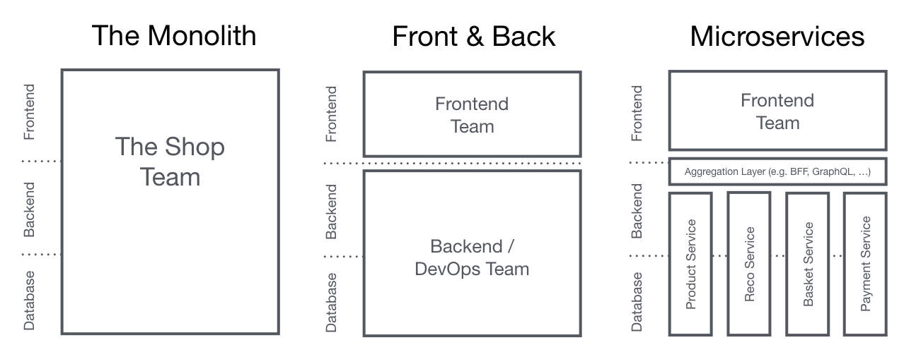
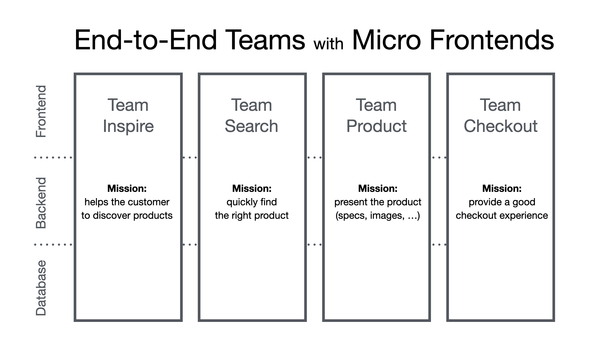
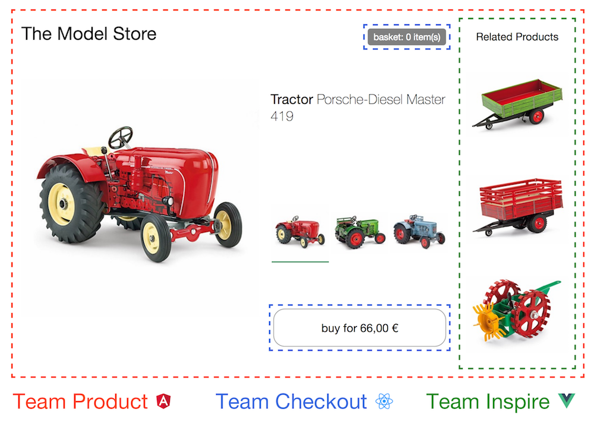
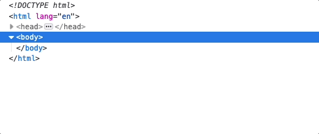
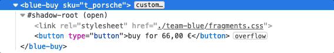
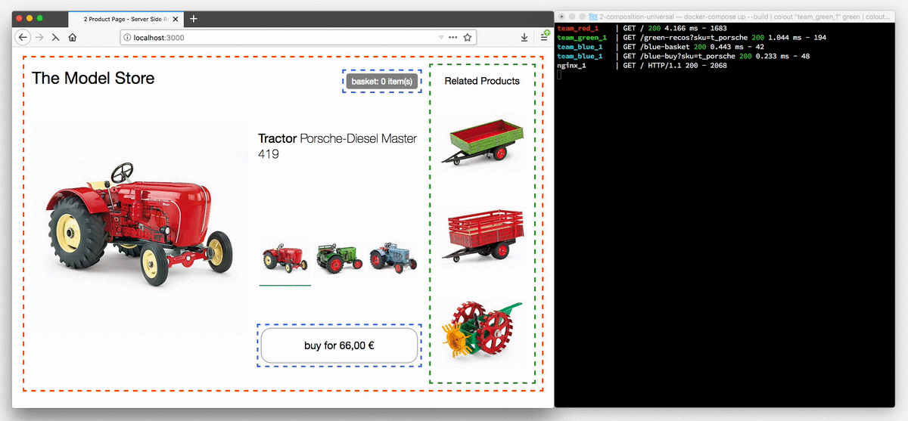
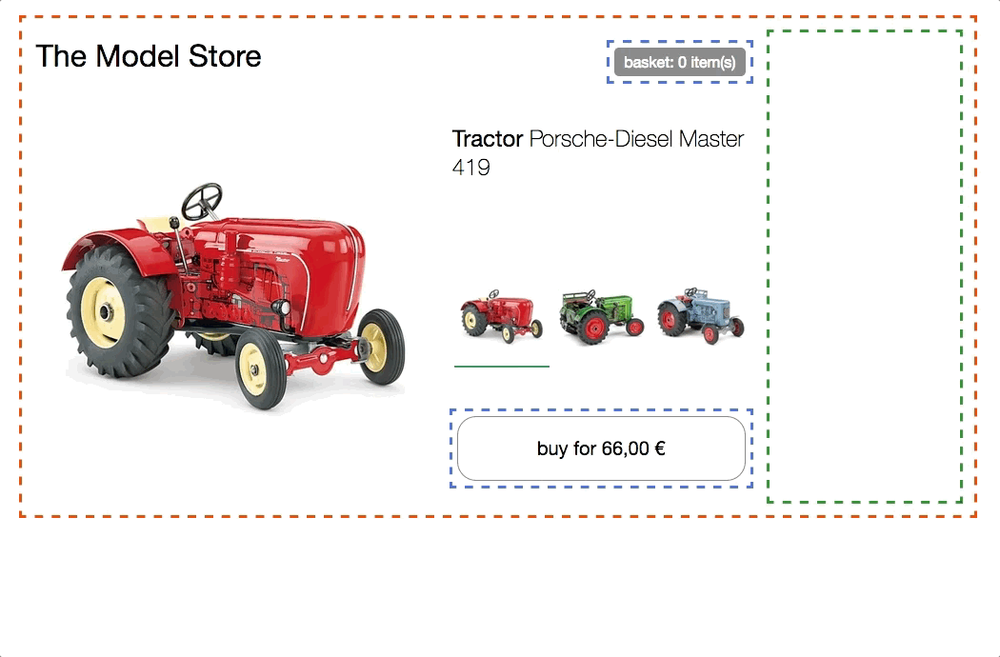
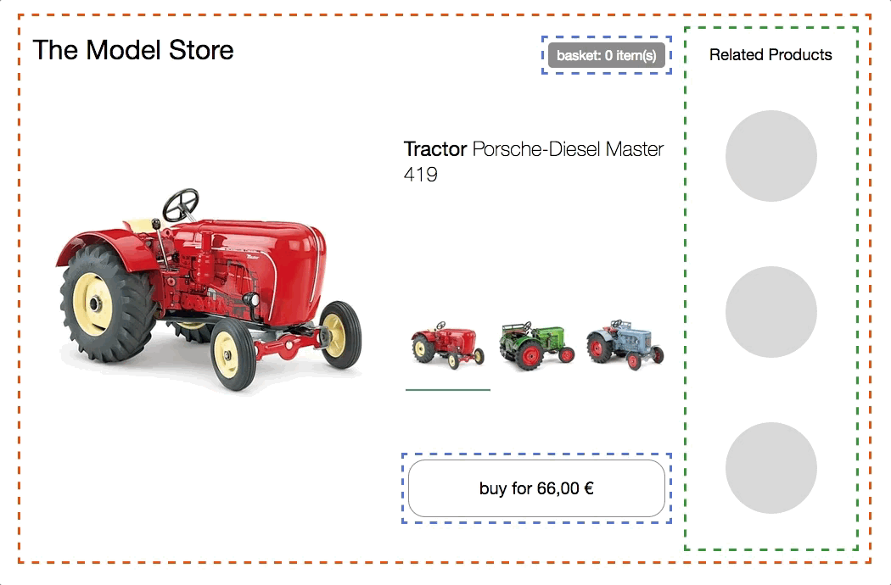

Techniques, strategies and recipes for building a __modern web app__ with __multiple teams__ that can __ship features independently__.

## What are Micro Frontends?

The term __Micro Frontends__ first came up in [ThoughtWorks Technology Radar](https://www.thoughtworks.com/radar/techniques/micro-frontends) at the end of 2016. It extends the concepts of micro services to the frontend world. The current trend is to build a feature-rich and powerful browser application, aka single page app, which sits on top of a micro service architecture. Over time the frontend layer, often developed by a separate team, grows and gets more difficult to maintain. That's what we call a [Frontend Monolith](https://www.youtube.com/watch?v=pU1gXA0rfwc).

The idea behind Micro Frontends is to think about a website or web app as __a composition of features__ which are owned by __independent teams__. Each team has a __distinct area of business__ or __mission__ it cares about and specialises in. A team is __cross functional__ and develops its features __end-to-end__, from database to user interface.

However, this idea is not new. It has a lot in common with the [Self-contained Systems](http://scs-architecture.org/) concept. In the past approaches like this went by the name of [Frontend Integration for Verticalised Systems](https://dev.otto.de/2014/07/29/scaling-with-microservices-and-vertical-decomposition/). But Micro Frontends is clearly a more friendly and less bulky term.

__Monolithic Frontends__

__Organisation in Verticals__

## What's a Modern Web App?

In the introduction I've used the phrase "building a modern web app". Let's define the assumptions that are connected with this term.

To put this into a broader perspective, [Aral Balkan](https://ar.al/) has written a blog post about what he calls the [Documents‐to‐Applications Continuum](https://ar.al/notes/the-documents-to-applications-continuum/). He comes up with the concept of a sliding scale where a site, built out of __static documents__, connected via links, is __on the left__ end and a pure behaviour driven, __contentless application__ like an online photo editor is __on the right__.

If you would position your project on the __left side of this spectrum__, an __integration on webserver level__ is a good fit. With this model a server collects and __concatenates HTML strings__ from all components that make up the page requested by the user. Updates are done by reloading the page from the server or replacing parts of it via ajax. [Gustaf Nilsson Kotte](https://twitter.com/gustaf_nk/) has written a [comprehensive article](https://gustafnk.github.io/microservice-websites/) on this topic.

When your user interface has to provide __instant feedback__, even on unreliable connections, a pure server rendered site is not sufficient anymore. To implement techniques like [Optimistic UI](https://www.smashingmagazine.com/2016/11/true-lies-of-optimistic-user-interfaces/) or [Skeleton Screens](http://www.lukew.com/ff/entry.asp?1797) you need to be able to also __update__ your UI __on the device itself__. Google's term [Progressive Web Apps](https://developers.google.com/web/progressive-web-apps/) aptly describes the __balancing act__ of being a good citizen of the web (progressive enhancement) while also providing app-like performance. This kind of application is located somewhere __around the middle of the site-app-continuum__. Here a solely server based solution is not sufficient anymore. We have to move the __integration into the browser__, and this is the focus of this article.

## Core Ideas behind Micro Frontends

* __Be Technology Agnostic__ Each team should be able to choose and upgrade their stack without having to coordinate with other teams. [Custom Elements](#the-dom-is-the-api) are a great way to hide implementation details while providing a neutral interface to others.
* __Isolate Team Code__ Don’t share a runtime, even if all teams use the same framework. Build independent apps that are self contained. Don't rely on shared state or global variables.
* __Establish Team Prefixes__ Agree on naming conventions where isolation is not possible yet. Namespace CSS, Events, Local Storage and Cookies to avoid collisions and clarify ownership.
* __Favor Native Browser Features over Custom APIs__ Use [Browser Events for communication](#parent-child-communication--dom-modification) instead of building a global PubSub system. If you really have to build a cross team API, try keeping it as simple as possible.
* __Build a Resilient Site__ Your feature should be useful, even if JavaScript failed or hasn't executed yet. Use [Universal Rendering](#serverside-rendering--universal-rendering) and Progressive Enhancement to improve perceived performance.

---

## The DOM is the API

[Custom Elements](https://developers.google.com/web/fundamentals/getting-started/primers/customelements), the interoperability aspect from the Web Components Spec, are a good primitive for integration in the browser. Each team builds their component __using their web technology of choice__ and __wraps it inside a Custom Element__ (e.g. `<order-minicart></order-minicart>`). The DOM specification of this particular element (tag-name, attributes & events) acts as the contract or public API for other teams. The advantage is that they can use the component and its functionality without having to know the implementation. They just have to be able to interact with the DOM.

But Custom Elements alone are not the solution to all our needs. To address progressive enhancement, universal rendering or routing we need additional pieces of software.

This page is divided into two main areas. First we will discuss [Page Composition](#page-composition) - how to assemble a page out of components owned by different teams. After that we'll show examples for implementing clientside [Page Transition](#navigating-between-pages).

## Page Composition

Beside the __client-__ and __serverside__ integration of code written in __different frameworks__ itself, there are a lot of side topics that should be discussed: mechanisms to __isolate js__, __avoid css conflicts__, __load resources__ as needed, __share common resources__ between teams, handle __data fetching__ and think about good __loading states__ for the user. We'll go into these topics one step at a time.

### The Base Prototype

The product page of this model tractor store will serve as the basis for the following examples.

It features a __variant selector__ to switch between the three different tractor models. On change product image, name, price and recommendations are updated. There is also a __buy button__, which adds the selected variant to the basket and a __mini basket__ at the top that updates accordingly.

[try in browser](./0-model-store/) & [inspect the code](https://github.com/neuland/micro-frontends/tree/master/0-model-store)

All HTML is generated client side using __plain JavaScript__ and ES6 Template Strings with __no dependencies__. The code uses a simple state/markup separation and re-renders the entire HTML client side on every change - no fancy DOM diffing and __no universal rendering__ for now. Also __no team separation__ - [the code](https://github.com/neuland/micro-frontends/tree/master/0-model-store) is written in one js/css file.

### Clientside Integration

In this example, the page is split into separate components/fragments owned by three teams. __Team Checkout__ (blue) is now responsible for everything regarding the purchasing process - namely the __buy button__ and __mini basket__. __Team Inspire__ (green) manages the __product recommendations__ on this page. The page itself is owned by __Team Product__ (red).

[try in browser](./1-composition-client-only/) & [inspect the code](https://github.com/neuland/micro-frontends/tree/master/1-composition-client-only)

Each team

__Team Product__ decides which functionality is included and where it is positioned in the layout. The page contains information that can be provided by Team Product itself, like the product name, image and the available variants. But it also includes fragments (Custom Elements) from the other teams.

### How to Create a Custom Element?

Lets take the __buy button__ as an example. Team Product includes the button simply adding `<blue-buy sku="t_porsche"></blue-buy>` to the desired position in the markup. For this to work, Team Checkout has to register the element `blue-buy` on the page.

    class BlueBuy extends HTMLElement {
      connectedCallback() {
        this.innerHTML = `<button type="button">buy for 66,00 €</button>`;
      }

      disconnectedCallback() { ... }
    }
    window.customElements.define('blue-buy', BlueBuy);

Now every time the browser comes across a new `blue-buy` tag, the `connectedCallback` is called. `this` is the reference to the root DOM node of the custom element. All properties and methods of a standard DOM element like `innerHTML` or `getAttribute()` can be used.

When naming your element the only requirement the spec defines is that the name must __include a dash (-)__ to maintain compatibility with upcoming new HTML tags. In the upcoming examples the naming convention `[team_color]-[feature]` is used. The team namespace guards against collisions and this way the ownership of a feature becomes obvious, simply by looking at the DOM.

### Parent-Child Communication / DOM Modification

When the user selects another tractor in the __variant selector__, the __buy button has to be updated__ accordingly. To achieve this Team Product can simply __remove__ the existing element from the DOM __and insert__ a new one.

    container.innerHTML;
    // => <blue-buy sku="t_porsche">...</blue-buy>
    container.innerHTML = '<blue-buy sku="t_fendt"></blue-buy>';

The `disconnectedCallback` of the old element gets invoked synchronously to provide the element with the chance to clean up things like event listeners. After that the `connectedCallback` of the newly created `t_fendt` element is called.

Another more performant option is to just update the `sku` attribute on the existing element.

    document.querySelector('blue-buy').setAttribute('sku', 't_fendt');

If Team Product used a templating engine that features DOM diffing, like React, this would be done by the algorithm automatically.

To support this the Custom Element can implement the `attributeChangedCallback` and specify a list of `observedAttributes` for which this callback should be triggered.

    const prices = {
      t_porsche: '66,00 €',
      t_fendt: '54,00 €',
      t_eicher: '58,00 €',
    };

    class BlueBuy extends HTMLElement {
      static get observedAttributes() {
        return ['sku'];
      }
      connectedCallback() {
        this.render();
      }
      render() {
        const sku = this.getAttribute('sku');
        const price = prices[sku];
        this.innerHTML = `<button type="button">buy for ${price}</button>`;
      }
      attributeChangedCallback(attr, oldValue, newValue) {
        this.render();
      }
      disconnectedCallback() {...}
    }
    window.customElements.define('blue-buy', BlueBuy);

To avoid duplication a `render()` method is introduced which is called from `connectedCallback` and `attributeChangedCallback`. This method collects needed data and innerHTML's the new markup. When deciding to go with a more sophisticated templating engine or framework inside the Custom Element, this is the place where its initialisation code would go.

### Browser Support

The above example uses the Custom Element V1 Spec which is currently [supported in Chrome, Safari and Opera](http://caniuse.com/#feat=custom-elementsv1). But with [document-register-element](https://github.com/WebReflection/document-register-element) a lightweight and battle-tested polyfill is available to make this work in all browsers. Under the hood, it uses the [widely supported](http://caniuse.com/#feat=mutationobserver) Mutation Observer API, so there is no hacky DOM tree watching going on in the background.

### Framework Compatibility

Because Custom Elements are a web standard, all major JavaScript frameworks like Angular, React, Preact, Vue or Hyperapp support them. But when you get into the details, there are still a few implementation problems in some frameworks. At [Custom Elements Everywhere](https://custom-elements-everywhere.com/) [Rob Dodson](https://twitter.com/rob_dodson) has put together a compatibility test suite that highlights unresolved issues.

### Avoid Framework Anarchy

Using Custom Elements is a great way to achieve a high amount of decoupling between the fragments of the individual teams. This way, each team is free to pick the frontend framework of their choice. But just because you can does not mean that it's a wise idea to mix different technologies. Try to avoid [Micro Frontends Anarchy](https://www.thoughtworks.com/radar/techniques/micro-frontend-anarchy) and create a reasonable level of alignment between the various teams. This way, teams can share learning and best practices with each other. It will also make your life easier when you want to establish a central pattern library.
That said, the capability of mixing technologies can be handy when you're working with a legacy application and want to migrate to a new tech stack.

### Child-Parent or Siblings Communication / DOM Events

But passing down attributes is not sufficient for all interactions. In our example the __mini basket should refresh__ when the user performs a __click on the buy button__.

Both fragments are owned by Team Checkout (blue), so they could build some kind of internal JavaScript API that lets the mini basket know when the button was pressed. But this would require the component instances to know each other and would also be an isolation violation.

A cleaner way is to use a PubSub mechanism, where a component can publish a message and other components can subscribe to specific topics. Luckily browsers have this feature built-in. This is exactly how browser events like `click`, `select` or `mouseover` work. In addition to native events there is also the possibility to create higher level events with `new CustomEvent(...)`. Events are always tied to the DOM node they were created/dispatched on. Most native events also feature bubbling. This makes it possible to listen for all events on a specific sub-tree of the DOM. If you want to listen to all events on the page, attach the event listener to the window element. Here is how the creation of the `blue:basket:changed`-event looks in the example:

    class BlueBuy extends HTMLElement {
      [...]
      connectedCallback() {
        [...]
        this.render();
        this.firstChild.addEventListener('click', this.addToCart);
      }
      addToCart() {
        // maybe talk to an api
        this.dispatchEvent(new CustomEvent('blue:basket:changed', {
          bubbles: true,
        }));
      }
      render() {
        this.innerHTML = `<button type="button">buy</button>`;
      }
      disconnectedCallback() {
        this.firstChild.removeEventListener('click', this.addToCart);
      }
    }

The mini basket can now subscribe to this event on `window` and get notified when it should refresh its data.

    class BlueBasket extends HTMLElement {
      connectedCallback() {
        [...]
        window.addEventListener('blue:basket:changed', this.refresh);
      }
      refresh() {
        // fetch new data and render it
      }
      disconnectedCallback() {
        window.removeEventListener('blue:basket:changed', this.refresh);
      }
    }

With this approach the mini basket fragment adds a listener to a DOM element which is outside its scope (`window`). This should be ok for many applications, but if you are uncomfortable with this you could also implement an approach where the page itself (Team Product) listens to the event and notifies the mini basket by calling `refresh()` on the DOM element.

    // page.js
    const $ = document.getElementsByTagName;

    $('blue-buy')[0].addEventListener('blue:basket:changed', function() {
      $('blue-basket')[0].refresh();
    });

Imperatively calling DOM methods is quite uncommon, but can be found in [video element api](https://developer.mozilla.org/en-US/docs/Web/API/HTMLMediaElement#methods) for example. If possible the use of the declarative approach (attribute change) should be preferred.

## Serverside Rendering / Universal Rendering

Custom Elements are great for integrating components inside the browser. But when building a site that is accessible on the web, chances are that initial load performance matters and users will see a white screen until all js frameworks are downloaded and executed. Additionally, it's good to think about what happens to the site if the JavaScript fails or is blocked. [Jeremy Keith](https://adactio.com/) explains the importance in his ebook/podcast [Resilient Web Design](https://resilientwebdesign.com/). Therefore the ability to render the core content on the server is key. Sadly the web component spec does not talk about server rendering at all. No JavaScript, no Custom Elements :(

### Custom Elements + Server Side Includes = ❤️

To make server rendering work, the previous example is refactored. Each team has their own express server and the `render()` method of the Custom Element is also accessible via url.

    $ curl http://127.0.0.1:3000/blue-buy?sku=t_porsche
    <button type="button">buy for 66,00 €</button>

The Custom Element tag name is used as the path name - attributes become query parameters. Now there is a way to server-render the content of every component. In combination with the `<blue-buy>`-Custom Elements something that is quite close to a __Universal Web Component__ is achieved:

    <blue-buy sku="t_porsche">
      <!--#include virtual="/blue-buy?sku=t_porsche" -->
    </blue-buy>

The `#include` comment is part of [Server Side Includes](https://en.wikipedia.org/wiki/Server_Side_Includes), which is a feature that is available in most web servers. Yes, it's the same technique used back in the days to embed the current date on our web sites. There are also a few alternative techniques like [ESI](https://en.wikipedia.org/wiki/Edge_Side_Includes), [nodesi](https://github.com/Schibsted-Tech-Polska/nodesi), [compoxure](https://github.com/tes/compoxure) and [tailor](https://github.com/zalando/tailor), but for our projects SSI has proven itself as a simple and incredibly stable solution.

The `#include` comment is replaced with the response of `/blue-buy?sku=t_porsche` before the web server sends the complete page to the browser. The configuration in nginx looks like this:

    upstream team_blue {
      server team_blue:3001;
    }
    upstream team_green {
      server team_green:3002;
    }
    upstream team_red {
      server team_red:3003;
    }

    server {
      listen 3000;
      ssi on;

      location /blue {
        proxy_pass  http://team_blue;
      }
      location /green {
        proxy_pass  http://team_green;
      }
      location /red {
        proxy_pass  http://team_red;
      }
      location / {
        proxy_pass  http://team_red;
      }
    }

The directive `ssi: on;` enables the SSI feature and an `upstream` and `location` block is added for every team to ensure that all urls which start with `/blue` will be routed to the correct application (`team_blue:3001`). In addition the `/` route is mapped to team red, which is controlling the homepage / product page.

This animation shows the tractor store in a browser which has __JavaScript disabled__.

[inspect the code](https://github.com/neuland/micro-frontends/tree/master/2-composition-universal)

The variant selection buttons now are actual links and every click leads to a reload of the page. The terminal on the right illustrates the process of how a request for a page is routed to team red, which controls the product page and after that the markup is supplemented by the fragments from team blue and green.

When switching JavaScript back on, only the server log messages for the first request will be visible. All subsequent tractor changes are handled client side, just like in the first example. In a later example the product data will be extracted from the JavaScript and loaded via a REST api as needed.

You can play with this sample code on your local machine. Only [Docker Compose](https://docs.docker.com/compose/install/) needs to be installed.

    git clone https://github.com/neuland/micro-frontends.git
    cd micro-frontends/2-composition-universal
    docker-compose up --build

Docker then starts the nginx on port 3000 and builds the node.js image for each team. When you open [http://127.0.0.1:3000/](http://127.0.0.1:3000/) in your browser you should see a red tractor. The combined log of `docker-compose` makes it easy to see what is going on in the network. Sadly there is no way to control the output color, so you have to endure the fact that team blue might be highlighted in green :)

The `src` files are mapped into the individual containers and the node application will restart when you make a code change. Changing the `nginx.conf` requires a restart of `docker-compose` in order to have an effect. So feel free to fiddle around and give feedback.

### Data Fetching & Loading States

A downside of the SSI/ESI approach is, that the __slowest fragment determines the response time__ of the whole page.
So it's good when the response of a fragment can be cached.
For fragments that are expensive to produce and hard to cache it's often a good idea to exclude them from the initial render.
They can be loaded asynchronously in the browser.
In our example the `green-recos` fragment, that shows personalized recommendations is a candidate for this.

One possible solution would be that team red just skips the SSI Include.

**Before**

    <green-recos sku="t_porsche">
      <!--#include virtual="/green-recos?sku=t_porsche" -->
    </green-recos>

**After**

    <green-recos sku="t_porsche"></green-recos>

*Important Side-note: Custom Elements [cannot be self-closing](https://developers.google.com/web/fundamentals/web-components/customelements), so writing `<green-recos sku="t_porsche" />` would not work correctly.*

The rendering only takes place in the browser.
But, as can be seen in the animation, this change has now introduced a __substantial reflow__ of the page.
The recommendation area is initially blank.
Team greens JavaScript is loaded and executed.
The API call for fetching the personalized recommendation is made.
The recommendation markup is rendered and the associated images are requested.
The fragment now needs more space and pushes the layout of the page.

There are different options to avoid an annoying reflow like this.
Team red, which controls the page, could __fixate the recommendation containers height__.
On a responsive website its often tricky to determine the height, because it could differ for different screen sizes.
But the more important issue is, that __this kind of inter-team agreement creates a tight coupling__ between team red and green.
If team green wants to introduce an additional sub-headline in the reco element, it would have to coordinate with team red on the new height.
Both teams would have to rollout their changes simultaneously to avoid a broken layout.

A better way is to use a technique called [Skeleton Screens](https://blog.prototypr.io/luke-wroblewski-introduced-skeleton-screens-in-2013-through-his-work-on-the-polar-app-later-fd1d32a6a8e7).
Team red leaves the `green-recos` SSI Include in the markup.
In addition team green changes the __server-side render method__ of its fragment so that it produces a __schematic version of the content__.
The __skeleton markup__ can reuse parts of the real content's layout styles.
This way it __reserves the needed space__ and the fill-in of the actual content does not lead to a jump.

Skeleton screens are also __very useful for client rendering__.
When your custom element is inserted into the DOM due to a user action it could __instantly render the skeleton__ until the data it needs from the server has arrived.

Even on an __attribute change__ like for the _variant select_ you can decide to switch to skeleton view until the new data arrives.
This ways the user gets an indication that something is going on in the fragment.
But when your endpoint responds quickly a short __skeleton flicker__ between the old and new data could also be annoying.
Preserving the old data or using intelligent timeouts can help.
So use this technique wisely and try to get user feedback.

## Navigating Between Pages

__to be continued soon ... (I promise)__

watch the [Github Repo](https://github.com/neuland/micro-frontends) to get notified

## Additional Resources
- [Book: Micro Frontends in Action](https://www.manning.com/books/micro-frontends-in-action?a_aid=mfia&a_bid=5f09fdeb) Written by me.
- [Talk: Micro Frontends - MicroCPH, Copenhagen 2019](https://www.youtube.com/watch?v=wCHYILvM7kU) ([Slides](https://noti.st/naltatis/zQb2m5/micro-frontends-the-nitty-gritty-details-or-frontend-backend-happyend)) The Nitty Gritty Details or Frontend, Backend, 🌈 Happyend
- [Talk: Micro Frontends - Web Rebels, Oslo 2018](https://www.youtube.com/watch?v=dTW7eJsIHDg) ([Slides](https://noti.st/naltatis/HxcUfZ/micro-frontends-think-smaller-avoid-the-monolith-love-the-backend)) Think Smaller, Avoid the Monolith, ❤️the Backend
- [Slides: Micro Frontends - JSUnconf.eu 2017](https://speakerdeck.com/naltatis/micro-frontends-building-a-modern-webapp-with-multiple-teams)
- [Talk: Break Up With Your Frontend Monolith - JS Kongress 2017](https://www.youtube.com/watch?v=W3_8sxUurzA) Elisabeth Engel talks about implementing Micro Frontends at gutefrage.net
- [Article: Micro Frontends](https://martinfowler.com/articles/micro-frontends.html) Article by Cam Jackson on Martin Fowlers Blog
- [Post: Micro frontends - a microservice approach to front-end web development](https://medium.com/@tomsoderlund/micro-frontends-a-microservice-approach-to-front-end-web-development-f325ebdadc16) Tom Söderlund explains the core concept and provides links on this topic
- [Post: Microservices to Micro-Frontends](http://www.agilechamps.com/microservices-to-micro-frontends/) Sandeep Jain summarizes the key principals behind microservices and micro frontends
- [Link Collection: Micro Frontends by Elisabeth Engel](https://micro-frontends.zeef.com/elisabeth.engel?ref=elisabeth.engel&share=ee53d51a914b4951ae5c94ece97642fc) extensive list of posts, talks, tools and other resources on this topic
- [Awesome Micro Frontends](https://github.com/ChristianUlbrich/awesome-microfrontends) a curated list of links by Christian Ulbrich 🕶
- [Custom Elements Everywhere](https://custom-elements-everywhere.com/) Making sure frameworks and custom elements can be BFFs
- Tractors are purchasable at [manufactum.com](https://www.manufactum.com/) :) _This store is developed by two teams using the here described techniques._

## Related Techniques
- [Posts: Cookie Cutter Scaling](https://paulhammant.com/categories.html#Cookie_Cutter_Scaling) David Hammet wrote a series of blog posts on this topic.
- [Wikipedia: Java Portlet Specification](https://en.wikipedia.org/wiki/Java_Portlet_Specification) Specification that addresses similar topics for building enterprise portals.

---

## Things to come ... (very soon)

- Use Cases
  - Navigating between pages
    - soft vs. hard navigation
    - universal router
  - ...
- Side Topics
  - Isolated CSS / Coherent User Interface / Style Guides & Pattern Libraries
  - Performance on initial load
  - Performance while using the site
  - Loading CSS
  - Loading JS
  - Integration Testing
  - ...

## Contributors
- [Koike Takayuki](https://github.com/koiketakayuki) who translated the site to [Japanese](https://micro-frontends-japanese.org/).
- [Jorge Beltrán](https://github.com/scipion) who translated the site to [Spanish](https://micro-frontends-es.org).
- [Bruno Carneiro](https://github.com/Tautorn) who translated the site to [Portuguese](https://tautorn.github.io/micro-frontends/).
- [Soobin Bak](https://github.com/soobing) who translated the site to [Korean](https://soobing.github.io/micro-frontends/).
- [Sergei Babin](https://github.com/serzn1) who translated the site to [Russian](https://serzn1.github.io/micro-frontends/).
- [Shiwei Yang](https://github.com/swearer23) who translated the site to [Chinese](https://swearer23.github.io/micro-frontends/).
- [Riccardo Moschetti](https://github.com/RiccardoGMoschetti) who translated the site to [Italian](https://riccardogmoschetti.github.io/micro-frontends/).

This site is generated by Github Pages. Its source can be found at [neuland/micro-frontends](https://github.com/neuland/micro-frontends/).
